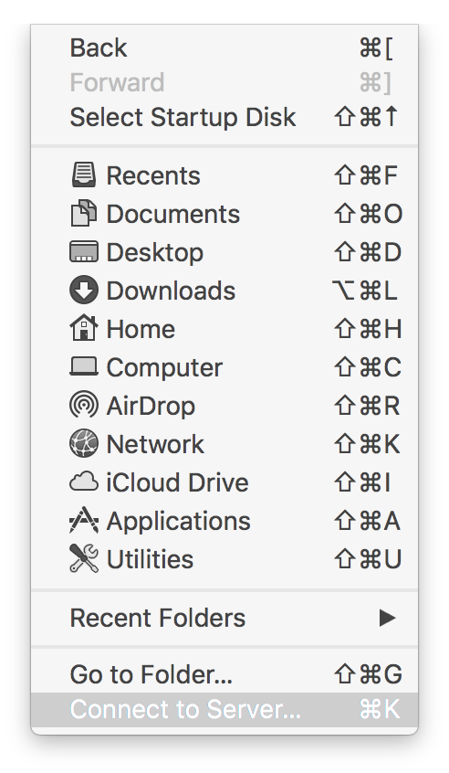
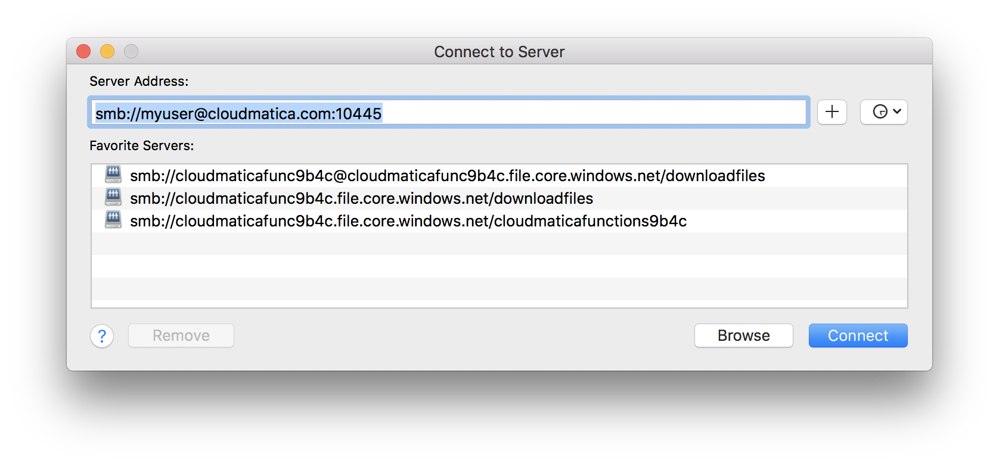
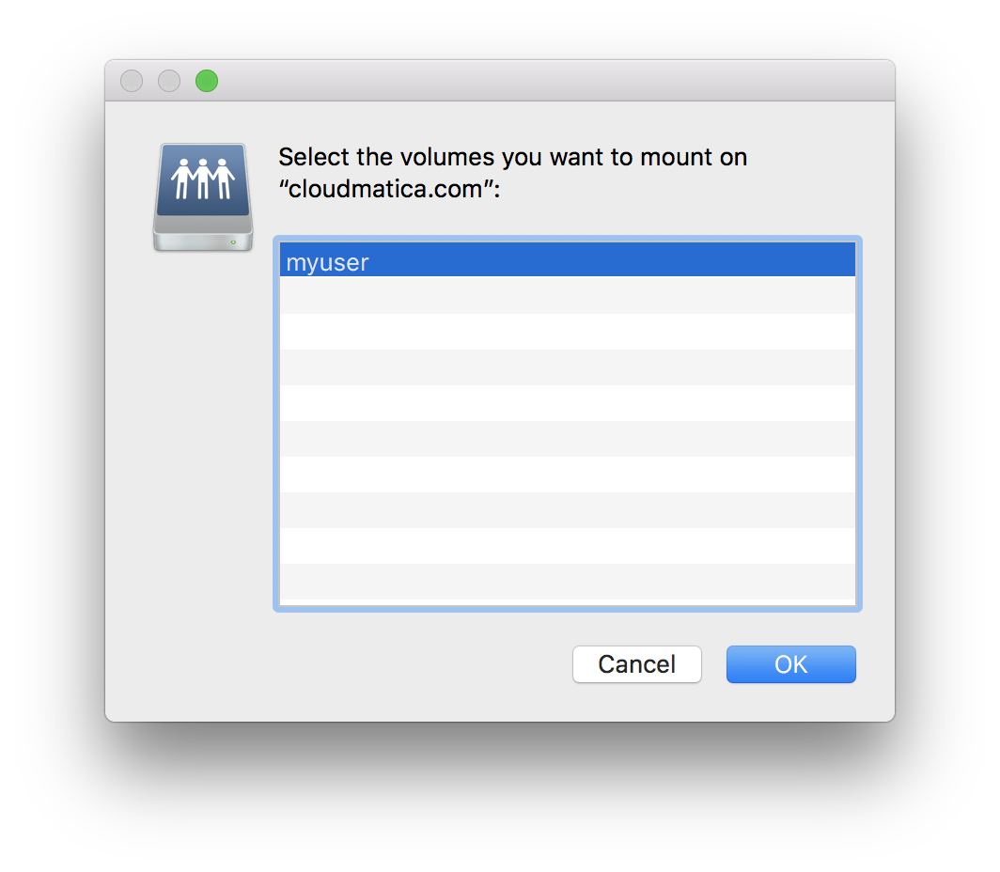
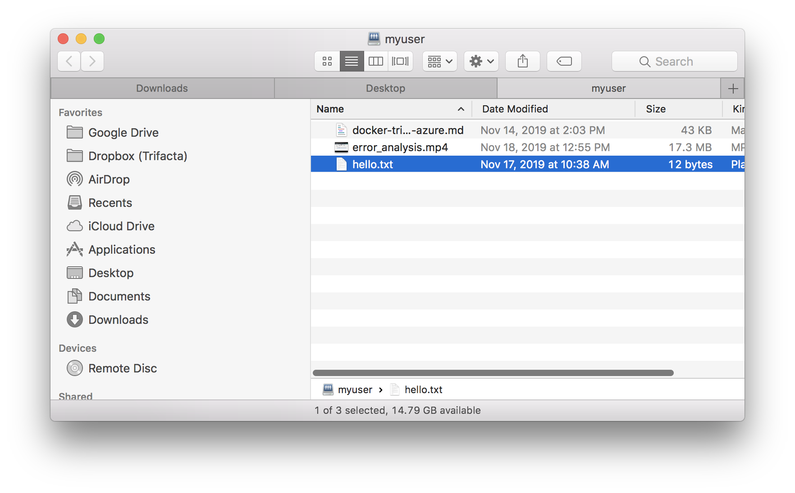

# docker-samba

The following docker container exposes a folder through Samba (SMB)

You can run this container as follows:

```
docker pull vbalasu/samba
./run.sh
```

Be sure to allow network traffic on the SMB ports - 139 and 445


#### Dockerfile

```
FROM ubuntu:latest
RUN apt-get update -y && apt-get install -y samba cifs-utils vim
COPY smb.conf /etc/samba/smb.conf
RUN mkdir /myuser
RUN chmod 777 /myuser
RUN adduser --disabled-password --gecos "" myuser
RUN (echo myuser; echo myuser) | smbpasswd myuser -as
ENTRYPOINT /etc/init.d/smbd restart && tail -f /dev/null
```


#### build.sh

```
docker build -t vbalasu/samba .
```


#### run.sh

```
docker run --rm -d -p 139:139 -p 445:445 -v $(pwd)/myuser:/myuser vbalasu/samba 
```


### Update the default smb.conf to include the following:

```
[myuser]
   comment = My User's cloud directory
   path = /myuser
   read only = no
   guest ok = yes
;   browseable = no

```

### Connect from a client

On a Mac, you can use Finder and choose Go --> Connect to server (Command-K)

then enter the path as shown in the below example:

```
smb://myuser@192.168.86.144
```

Choose the username and password (myuser) to connect


# Connect to a share on the cloud

You can run the docker container in an Amazon EC2 instance, or other VM technology in the cloud (eg. Azure or GCP)

Note that many ISPs will block traffic on the standard SMB port 445

To get around this limitation, update run.sh to have docker forward traffic from another port (eg. 10445) on the host to port 445 on the container, as follows:

```
docker run --rm -d -p 10139:139 -p 10445:445 -v $(pwd)/myuser:/myuser vbalasu/samba
```

Then open up port 10445 through a security group to the outside world.

You should now be able to connect to your server by specifying the port number as follows:

```
smb://myuser@<<hostname>>:10445
```

### Connect from an Android

Use a File Manager app, such as ES File Explorer. Go to Network --> LAN, and choose New. Then enter the server as `<<hostname>>:10445`, and enter your credentials. After a brief delay, you will be able to browse your files.

### Connect from a Mac

Open Finder, and choose Go-->Connect to server. Enter the SMB url as shown above. When prompted, enter the credentials





